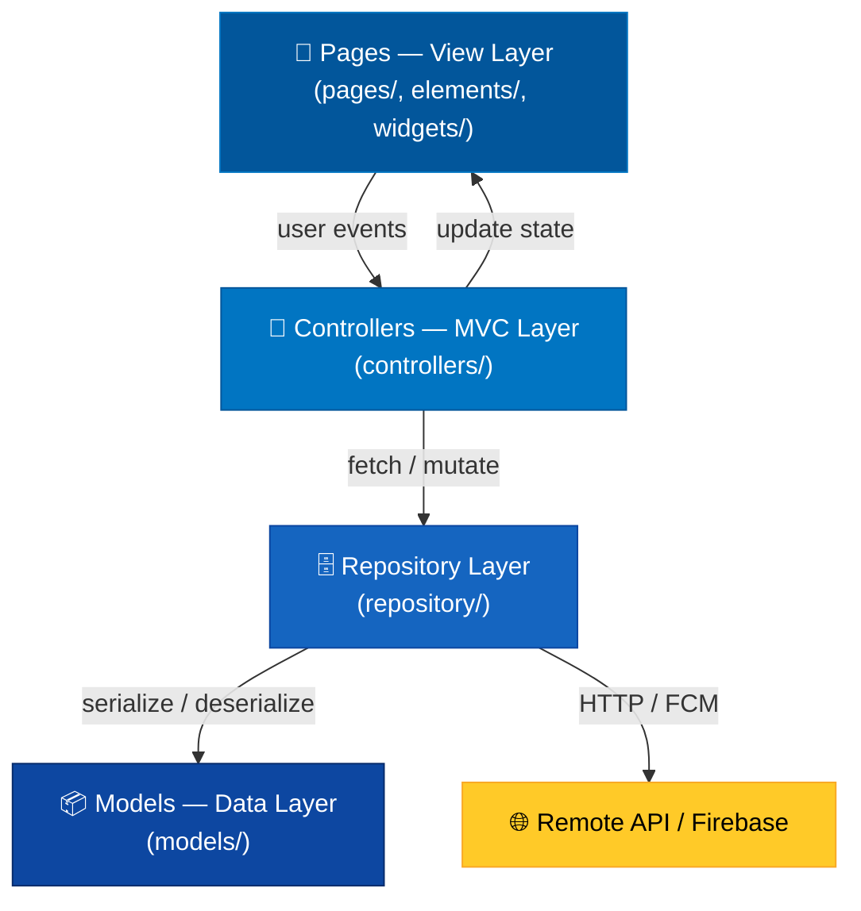
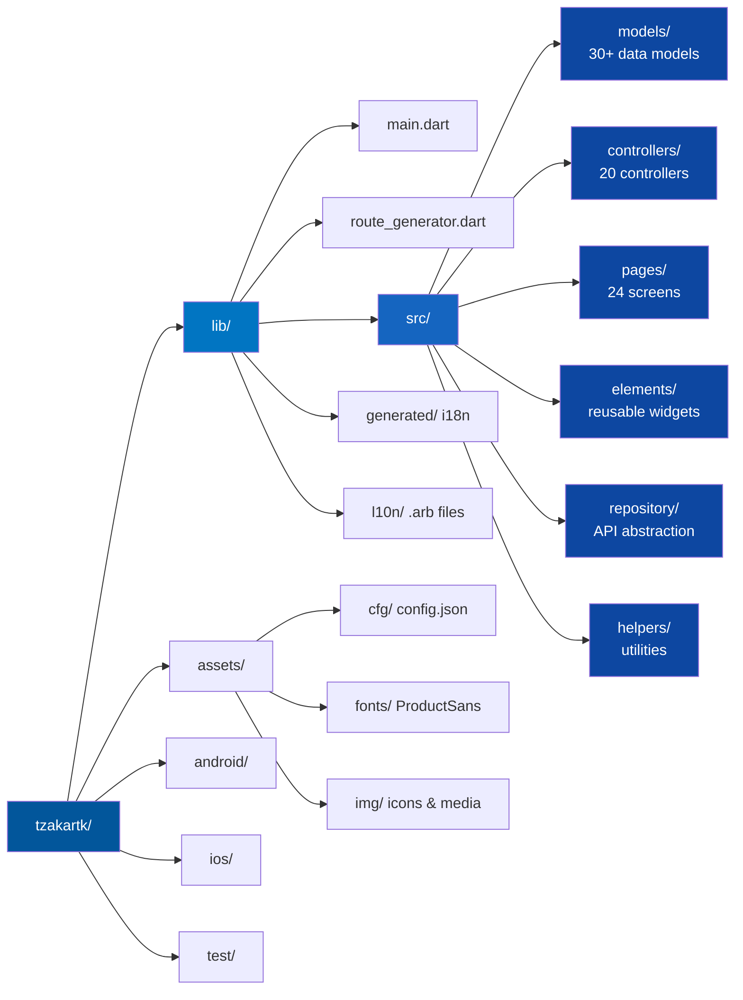
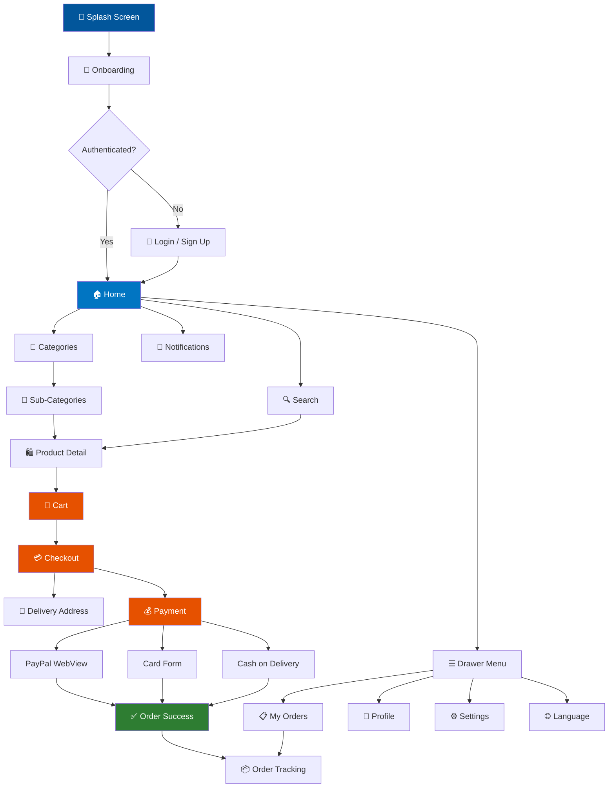
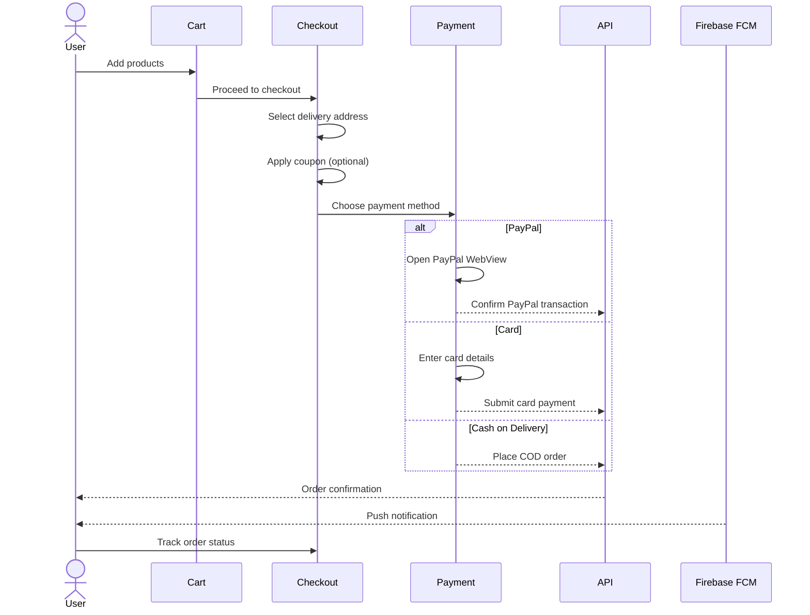

<div align="center">


# Tzakartk — تذكرتك

### Cross-Border E-Commerce & Gift Delivery Platform for Syria

*Shop internationally. Deliver to your loved ones. Anywhere.*

---

[](https://flutter.dev)
[](https://dart.dev)
[]()
[](https://firebase.google.com)
[](https://developer.paypal.com)
[](https://developer.android.com)
[](https://developer.apple.com)
[](LICENSE)
[]()
[]()

</div>

---

## 📖 Overview

**Tzakartk** (تذكرتك — *"Your Gift"* in Arabic) is a production-ready Flutter e-commerce application purpose-built for **international shopping and gift delivery to Syria**. It enables users abroad to browse products, place orders, and have gifts delivered directly to their loved ones back home — seamlessly and securely.

The app is built on a clean **MVC (Model-View-Controller)** architecture with a full repository layer, ensuring scalability, testability, and maintainability across a large codebase.

> 🌍 Built for the Syrian diaspora. Powered by Flutter.

| | |
|---|---|
| **App Version** | `2.0.0+9` |
| **Dart SDK** | `>=2.2.2 <3.0.0` |
| **AndroidX** | ✅ Enabled |
| **Null Safety** | Partial (nullsafety pre-releases used) |
| **Build outputs** | APK · AAB (Play Store) · iOS |

---

## ✨ Features

| Feature | Description |
|---|---|
| 🛍️ **Product Catalog** | Browse categories, subcategories, trending items with carousel UI |
| 🔍 **Smart Search** | Real-time search with filters by category, price, and availability |
| 🛒 **Shopping Cart** | Full cart management with quantity control and coupon support |
| 💳 **Payment Methods** | PayPal, credit/debit card (Visa, Mastercard) integration |
| 📦 **Order Tracking** | Real-time order status and delivery tracking |
| 📍 **Address Management** | Multi-address support with city/country picker for Syria |
| 🔔 **Push Notifications** | Firebase Cloud Messaging for order updates |
| 🌐 **Bilingual UI** | Full Arabic (RTL) and English (LTR) support via intl |
| 👤 **User Accounts** | Registration, login, profile, and password recovery |
| 🎁 **Gift Delivery** | Dedicated receiver info flow for third-party delivery |
| 🏠 **Onboarding** | Custom animated introduction screens |
| 🎨 **Themed UI** | Product Sans typography with polished Material design |

---

## 🏗️ Architecture

Tzakartk follows a strict **MVC (Model-View-Controller)** pattern with an additional **Repository Layer** for data abstraction.

### Layer Responsibilities



### Project Structure



---

## 🗺️ App Navigation Flow



<details>
<summary><strong>📱 Pages (24 screens)</strong></summary>

- `splash_screen.dart` — Branded launch screen
- `on_boarding.dart` — Custom introduction flow
- `home.dart` — Main feed with banners & products
- `category.dart` / `product.dart` — Catalog browsing
- `cart.dart` / `checkout.dart` — Purchase flow
- `paypal_payment.dart` — PayPal WebView integration
- `tracking.dart` — Real-time order tracking
- `orders.dart` / `order_success.dart` — Order management
- `delivery_addresses.dart` / `delivery_pickup.dart` — Logistics
- `countries_and_cities.dart` — Syria geo-selector
- `profile.dart` / `settings.dart` — Account management
- `login.dart` / `signup.dart` / `forget_password.dart` — Auth
- `notifications.dart` — Notification center
- `languages.dart` — Language switcher

</details>

<details>
<summary><strong>🧩 Controllers (20 controllers)</strong></summary>

`CartController` · `CategoryController` · `CheckoutController` · `CountriesCitiesController` · `DeliveryAddressesController` · `DeliveryPickupController` · `FilterController` · `HomeController` · `NotificationController` · `OnBoardingController` · `OrderController` · `PaypalController` · `ProductController` · `ProfileController` · `SearchController` · `SettingsController` · `SplashScreenController` · `TrackingController` · `UserController`

</details>

<details>
<summary><strong>🗄️ Models (30+ models)</strong></summary>

`User` · `Product` · `Cart` · `CartPrice` · `Order` · `OrderStatus` · `ProductOrder` · `Category` · `SubCategory` · `Shop` · `Address` · `Country` · `City` · `CreditCard` · `Payment` · `PaymentMethod` · `Coupon` · `Notification` · `Filter` · `Option` · `OptionGroup` · `Media` · `Setting` · `Language` · `Field` · `Note` · `DeliveryNote` · `OnBoarding` · `RouteArgument`

</details>

---

## 🚀 Getting Started

### Prerequisites

| Tool | Version |
|---|---|
| Flutter SDK | `>=2.x` (stable) |
| Dart SDK | `>=2.2.2 <3.0.0` |
| Android Studio / Xcode | Latest stable |
| Firebase project | Required (core, auth, messaging, firestore) |
| AndroidX | ✅ Enabled |

### Installation

```bash
# 1. Clone the repository
git clone https://github.com/YOUR_USERNAME/tzakartk.git
cd tzakartk

# 2. Install dependencies
flutter pub get

# 3. Generate localization files
flutter gen-l10n

# 4. Configure Firebase
# Place your google-services.json in android/app/
# Place your GoogleService-Info.plist in ios/Runner/

# 5. Configure app settings
# Edit assets/cfg/configurations.json with your API endpoints

# 6. Run the app
flutter run
```

### Build for Release

```bash
# Android APK
flutter build apk --release

# Android App Bundle (Play Store)
flutter build appbundle --release

# iOS
flutter build ios --release
```

Or use the provided build script:

```bash
chmod +x build.sh && ./build.sh
```

---

## ⚙️ Configuration

The app uses [`global_configuration`](https://pub.dev/packages/global_configuration) `2.0.0-nullsafety.0` to load runtime settings from `assets/cfg/configurations.json` at launch. This is registered as a Flutter asset so it's bundled with the app at build time.

```json
{
  "baseUrl": "https://your-api.com/api",
  "paypalClientId": "YOUR_PAYPAL_CLIENT_ID",
  "paypalSecret": "YOUR_PAYPAL_SECRET",
  "currency": "USD",
  "currencyRight": false
}
```

Loaded in `main.dart` before `runApp()`:

```dart
await GlobalConfiguration().loadFromAsset("configurations");
```

> ⚠️ **Never commit sensitive credentials.** For production, use CI/CD secrets injection or a secure backend config endpoint.

---

## 🌐 Internationalization

Full bilingual support powered by **Flutter's `intl` package** (`0.17.0`) and **`intl_utils`** (`1.9.0`) for ARB-based code generation:

| Language | Code | Direction |
|---|---|---|
| Arabic | `ar` | RTL ← |
| English | `en` | LTR → |

**Source files** (`lib/l10n/`):
- `intl_ar.arb` — Arabic strings
- `intl_en.arb` — English strings

**Auto-generated output** (`lib/generated/`):
- `i18n.dart` — Localization class
- `l10n.dart` — Delegate registration
- `intl/messages_ar.dart` — Arabic message catalog
- `intl/messages_en.dart` — English message catalog
- `intl/messages_all.dart` — Combined loader

Enabled in `pubspec.yaml`:

```yaml
flutter_intl:
  enabled: true
```

Regenerate after editing `.arb` files:

```bash
flutter pub run intl_utils:generate
```

---

## 💳 Payment Integration

| Method | Status |
|---|---|
| PayPal | ✅ WebView-based flow |
| Visa / Mastercard | ✅ Card form UI |
| Cash on Delivery | ✅ Supported |

### Purchase Flow



---

## 🔔 Notifications

Firebase Cloud Messaging (FCM) is integrated for:
- Order confirmation
- Shipping updates
- Delivery notifications
- Promotional messages

---

## 📦 Dependencies

### Full Dependency Table

| Package | Version | Purpose |
|---|---|---|
| `mvc_pattern` | `6.6.4+2` | MVC architecture state management |
| `firebase_core` | `0.5.3` | Firebase initialization |
| `firebase_auth` | `0.18.4+1` | User authentication |
| `firebase_messaging` | `7.0.3` | Push notifications (FCM) |
| `cloud_firestore` | `0.14.4` | Realtime NoSQL database |
| `global_configuration` | `2.0.0-nullsafety.0` | Runtime app config from JSON |
| `shared_preferences` | `2.0.5` | Local key-value persistence |
| `webview_flutter` | `1.0.7` | PayPal in-app WebView |
| `url_launcher` | `6.0.2` | Open external links & WhatsApp |
| `cached_network_image` | `2.5.0` | Efficient image loading & caching |
| `carousel_slider` | `^4.0.0` | Home banner & product carousels |
| `flutter_svg` | `^0.19.3` | SVG asset rendering |
| `flutter_html` | `^1.2.0` | HTML content rendering |
| `html` | `0.14.0+4` | HTML parsing |
| `dropdown_search` | `^2.0.0` | Searchable dropdowns (city/country) |
| `photo_view` | `^0.13.0` | Zoomable product image viewer |
| `introduction_screen` | `^1.0.9` | Onboarding slides |
| `flutter_staggered_grid_view` | `0.4.0-nullsafety.3` | Staggered product grid layout |
| `fluttertoast` | `8.0.1-nullsafety.0` | In-app toast messages |
| `flutter_localizations` | SDK | i18n & RTL/LTR support |
| `intl_utils` | `1.9.0` | ARB file code generation |
| `cupertino_icons` | `1.0.2` | iOS-style icon set |
| `flutter_launcher_icons` | `^0.8.1` | App icon generation tool |

### Dependency Overrides

```yaml
dependency_overrides:
  intl: 0.17.0   # Pinned for compatibility across firebase + flutter_localizations
  http: 0.12.2   # Pinned for webview_flutter compatibility
```

### Dependency Architecture

```mermaid
graph TD
    APP["🚀 tzakartk\nv2.0.0+9"]

    APP --> STATE["State Management\nmvc_pattern 6.6.4"]
    APP --> FIREBASE["☁️ Firebase Suite"]
    APP --> UI["🎨 UI Components"]
    APP --> DATA["💾 Data & Storage"]
    APP --> PAYMENT["💳 Payments"]
    APP --> I18N["🌐 Localization"]
    APP --> UTILS["🛠️ Utilities"]

    FIREBASE --> FC["firebase_core 0.5.3"]
    FIREBASE --> FA["firebase_auth 0.18.4"]
    FIREBASE --> FM["firebase_messaging 7.0.3"]
    FIREBASE --> FF["cloud_firestore 0.14.4"]

    UI --> CS["carousel_slider ^4.0.0"]
    UI --> SVG["flutter_svg ^0.19.3"]
    UI --> CNI["cached_network_image 2.5.0"]
    UI --> PV["photo_view ^0.13.0"]
    UI --> SGV["flutter_staggered_grid_view 0.4.0"]
    UI --> IS["introduction_screen ^1.0.9"]
    UI --> DS["dropdown_search ^2.0.0"]
    UI --> FH["flutter_html ^1.2.0"]
    UI --> FT["fluttertoast 8.0.1"]

    DATA --> SP["shared_preferences 2.0.5"]
    DATA --> GC["global_configuration 2.0.0"]

    PAYMENT --> WV["webview_flutter 1.0.7\n(PayPal)"]

    I18N --> FL["flutter_localizations SDK"]
    I18N --> IU["intl_utils 1.9.0"]

    UTILS --> UL["url_launcher 6.0.2"]

    style APP fill:#02569B,color:#fff
    style FIREBASE fill:#FFCA28,color:#000
    style STATE fill:#7B1FA2,color:#fff
    style PAYMENT fill:#003087,color:#fff
    style UI fill:#1565C0,color:#fff
    style DATA fill:#2E7D32,color:#fff
    style I18N fill:#E65100,color:#fff
    style UTILS fill:#37474F,color:#fff
```



---

## 📁 Assets

```
assets/
├── cfg/
│   └── configurations.json      # Runtime app config (global_configuration)
├── fonts/
│   └── ProductSans              # Full weight family (100–900)
│       ├── Thin.ttf             # w100, w200
│       ├── Light.ttf            # w300
│       ├── Regular.ttf          # w400
│       ├── Medium.ttf           # w500
│       ├── Bold.ttf             # w600
│       └── Black.ttf            # w700, w800, w900
└── img/
    ├── logo.png                 # App logo (launcher icon source)
    ├── tzakartk.svg             # Brand mark
    ├── visa.png / visacard.png  # Visa payment icons
    ├── master.png / mastercard.png  # Mastercard icons
    ├── paypal.png               # PayPal logo
    ├── facebook.svg             # Social contact icons
    ├── instagram.svg
    ├── tiktok.svg
    ├── whatsapp.svg
    ├── arabic.png               # Language selector flags
    ├── english.png
    ├── loading.gif              # General skeleton loader
    ├── loading_card.gif         # Card skeleton loader
    └── loading_trend.gif        # Trending section loader
```